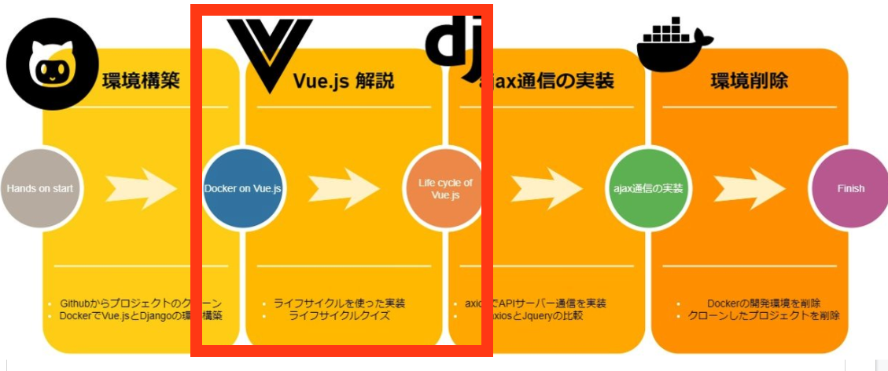
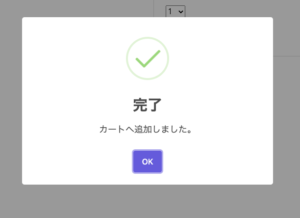

# アプリケーションコード修正(商品情報詳細画面)



続いては商品詳細画面です。

ここでは商品検索画面で選択した商品の詳細情報を確認できるるのと商品をカートに入れる機能がある画面です。

この画面でポイントとなるのはカートに入れる機能です。これはVuexというライブラリを使用して、商品をカートに入れます。

"Vuex"とはVue.js アプリケーションのための 状態管理パターン + ライブラリです。

https://vuex.vuejs.org/ja/ (Vue.js公式サイトより)

## 修正対象のソース
* client/ecsite/src/store/index.js
* client/ecsite/src/views/detailView.vue

## index.jsの修正
VuexをVue.jsで使用する際は以Vue.use(Vuex)で宣言し、Storeを定義します。

今回は既にstoreを宣言している状態で始めます。

storeの宣言で、state・getters・mutations・actionsという項目がありますが、これらはStoreが保持するデータ項目や、Store上のデータを他のソースから操作するための関数を定義する項目です。

* storeの４つの機能
  * state: アプリケーション全体の状態を保持する役割を果たす
  * getter: ストアのステートを取得するための算出データ
  * mutation: stateの値を更新する為に使用される
  * action: 非同期処理や外部APIとの通信を行う役割を果たす

下記図は公式サイトに掲載されているイメージ図です。


簡単に説明すると下記のような流れになります。

①Componentから、Vuexで定義したactionを呼び出す（Dispatchする）

②DispatchされたactionはAPIを通じて、サーバー側で何らかの処理をする

③サーバー側で返却されたデータをmutationへ送る（Commit）

④mutationがstateを変更する（Mutate）

⑤更新（Mutate）されたstateを、Component側に描画する（Render）

今回actionsは使用しませんが、Vuexの基本的な情報なので覚えておきましょう。

では、実際に修正してましょう。今回修正する箇所はmutationの箇所です。ここの処理がカートを入れる機能(stateに情報を保持)となります。
  
変更前
```
  mutations: {
    // 商品削除
    deleteItem (state, item) {
      // 引数で渡された行を削除
      state.itemList.splice(item, 1)
    },
    // 商品リスト初期化
    clearItem (state) {
      state.itemList = []
    },
    setProductName (state, productName) {
      state.productName = productName
    },
    setQuanitiy (state, quanitiy) {
      state.quanitiy = quanitiy
    }
  }
```


変更後
```
  mutations: {
    // 商品追加
    pushItem (state, item) {
      // 引数で渡された配列をまるごとpush
      state.itemList.push(item)
    },
    // 商品削除
    deleteItem (state, item) {
      // 引数で渡された行を削除
      state.itemList.splice(item, 1)
    },
    // 商品リスト初期化
    clearItem (state) {
      state.itemList = []
    },
    setProductName (state, productName) {
      state.productName = productName
    },
    setQuanitiy (state, quanitiy) {
      state.quanitiy = quanitiy
    }
  }
```

mutationは上記記載の通りに、stateの値(今回の場合は、商品名・商品説明・値段・商品数・商品画像)を更新することができます。

pushItemはカートボタンをクリック時に使用し、これで商品情報を保持することができます。これはdetailView.vueでも使用するので、覚えておきましょう。

他にも商品削除のdeleteItemなどありますが、こちらは次の章のカート画面上で使用します。


## detailView.vueの修正
ここでは、商品検索で選択した商品情報をカートに入れる処理を追加します。

methodの中にあるadditemを下記のように修正してみましょう。


変更前
```
addItem () {
  // storeに保存後ダイアログ表示して検索画面へ戻る
  this.$swal({
    title: '完了',
    icon: 'success',
    text: 'カートへ追加しました。',
    type: 'success',
    confirmButtonText: 'OK'
  }).then((info) => {
    this.$router.push({ path: '/' })
  })
}
```
変更後
```
addItem () {
  // storeに保存後ダイアログ出して検索画面に戻る
  const param = {
    name: this.productName,
    description: this.description,
    price: this.price,
    quantity: Number(this.quantity),
    imageUrl: this.img // 商品画像
  }
  this.$store.commit('pushItem', param)
  console.log(this.$store.getters.getItemList)
  // storeに保存後ダイアログ表示して検索画面へ戻る
  this.$swal({
    title: '完了',
    icon: 'success',
    text: 'カートへ追加しました。',
    type: 'success',
    confirmButtonText: 'OK'
  }).then((info) => {
    this.$router.push({ path: '/' })
  })
}
```
まず画面に表示されている商品のパラメーターをオブジェクトparamに設定します。それぞれ商品名・商品説明・値段・数量・商品画像の値です。

次に商品のパラメーターのデータを保持をしていきます。書き方としては、this.$store.commitでstoreのstateの値を変更します。
第一引数をstore/index.jsのmutationsに追加したpushItemにします。第二引数は商品情報を代入した変数paramにし、カートボタンを押した際はstore/index.jsのstateのitemListに情報が保持された状態になります。

次の章でのカート画面ではstoreの保持しているStateのitemListをgettersを使用して、表示されることになります。

## 動作確認
動作確認をしてみましょう。
プルダウンで任意の商品数を選択肢し、商品を購入のボタンをクリックしてください。

下記のように完了のダイアログが表示され検索画面に遷移すれば成功です。



次の章では選択した個数と商品は本当にカートに入っているか確認してみましょう。

また商品を削除するのにもVuexが使用されております。
mutationsに既にあったdeleteItemとclearItemです。deleteItemはカートに入った商品を削除する時に、clearItemは商品を注文した時に使用します。